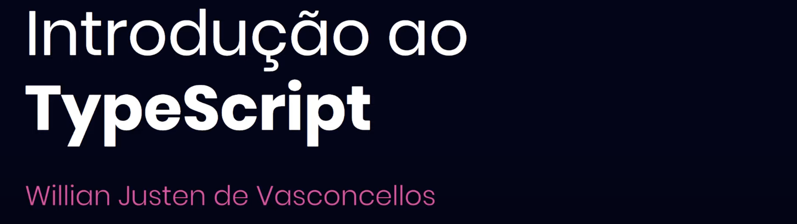

# Introdução - Mini-curso de TypeScript

### Anotações
- TypeScript é um superset do JavaScript.
- Adiciona novas features ao JavaScript.
- Tipagem estática.
- Compila para JavaScript.
- Permite uma adoção agradual.

### Beneficios
- Evita resultados inesperados.
- Avisa quando estámos cometendo erros ou práticas prejudiciais.
- Funciona como uma especie de documentação
- Deixa a IDE extremamente poderosa

### Desvantagem
- Necessita ser compilado.
- Apredizagem inicial dos tipos e boas práticas.

### Curso:
[Link do Curso](https://www.youtube.com/playlist?list=PLlAbYrWSYTiPanrzauGa7vMuve7_vnXG_)